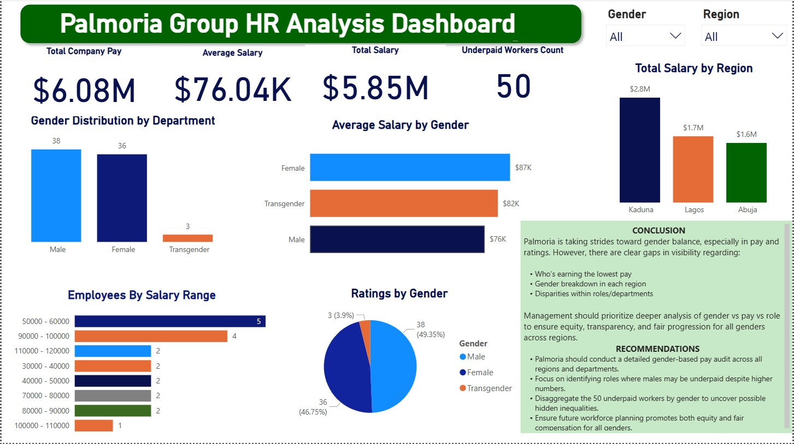
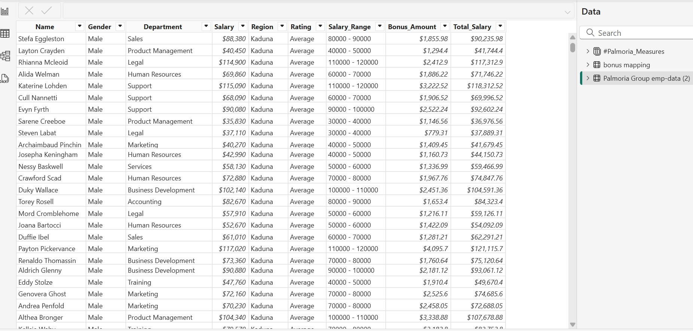

# 💼 Palmoria Gender Pay Analysis Dashboard

This project is a **Power BI dashboard** that analyzes **gender-based pay gaps, salary distribution, and employee ratings** across different departments and regions at Palmoria Group.
Using detailed employee data, the dashboard uncovers trends in compensation equity, highlights departmental salary disparities, and visualizes how employee performance ratings align with pay structures. 
It also offers insights into bonus allocations, regional salary patterns (with a focus on Kaduna, Lagos and Abuja), and the role gender may play in earnings across various job functions with interactive visuals and dynamic filtering, this dashboard serves as a valuable tool for HR decision-making, diversity and inclusion strategy, and executive reporting.

---
## 📂 Project Goal

To assist HR professionals and data analysts in identifying key workforce insights and taking data-driven actions to improve fairness, representation, and compensation alignment.

## 📊 Key Metrics & Insights

- **Total Company Pay:** $6.08M  
- **Average Salary:** $76.04K  
- **Underpaid Workers Identified:** 50  
- **Gender Representation:** Breakdown by department and region  
- **Average Salary by Gender:** Highlights disparities in pay  
- **Ratings by Gender:** Reflects employee sentiment across genders  
- **Employees by Salary Range:** Identifies pay clusters

---

## 🛠 Tools Used

- **Power BI Desktop**
- **DAX Measures** for calculating key metrics
- **Custom Visuals** for comparative and categorical insights

---

## 📈 Visual Insights
This Power BI dashboard provides an insightful overview of employee compensation, gender representation, and performance ratings across Palmoria Group. The purpose is to highlight trends, identify disparities, and inform HR strategies for equity and transparency.

### 👥 Gender Distribution by Department
- Male: 38
- Female: 36
- Transgender: 3  
Balanced gender presence with inclusive hiring practices evident.

### 💰 Average Salary by Gender
- Female: $87K  
- Transgender: $82K  
- Male: $70K  
Female and transgender employees earn more on average than male employees.

### 🌍 Total Salary by Region
- Kaduna: $2.8M  
- Lagos: $1.7M  
- Abuja: $1.6M  
Kaduna has the highest salary outlay, prompting the need for regional pay reviews.

### 🧾 Employees by Salary Range
Most employees fall between $50K–$100K; fewer exceed $150K.

### ⭐️ Ratings by Gender
- Female: 46.77%
- Male: 53.23%
- Transgender: No available rating data  
Potential gaps in performance visibility for non-binary employees.

---
## ✅ Conclusion

Palmoria Group is taking deliberate steps toward gender balance and inclusion, especially in pay equity. However, gaps remain in:
- Regional pay consistency
- Transparent employee evaluation
- Underpayment cases

---

## 📌 Recommendations

1. Investigate Underpayment: Analyze why 50 employees earn below expectations.
2. Conduct Salary Equity Audits: Regularly assess pay gaps across gender and region.
3. Standardize Ratings: Apply consistent performance evaluation criteria.
4. Increase Transparency: Share clear salary bands and promotion pathways.
5. Support Inclusion: Ensure all genders, especially underrepresented ones, are visible and empowered.
6. Review Regional Salaries: Adjust pay structures where significant differences exist.

---
## 📁 Files in this Repository

- `PalmoriaDashboard.pbix` — Main Power BI dashboard file  
- `visuals.png` — Screenshot preview of the dashboard  
- `README.md` — Project documentation (this file)

---

## 👤 Author

**Inawo Williams**  
Power BI Developer | Data & Surveillance Analyst

---

## 📄 License

This project is licensed under the [MIT License](LICENSE) — feel free to use and build upon it.

